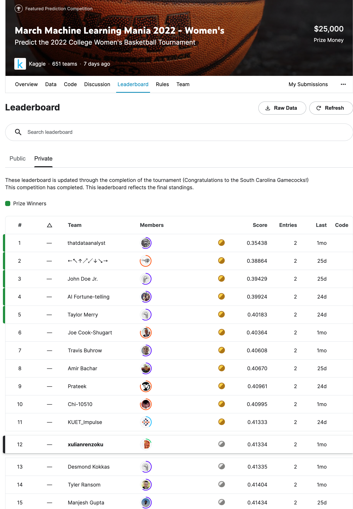

# March-Machine-Learning-Mania-2022-Womens
**#12 Solution for 'March Machine Learning Mania 2022 - Women's at Kaggle**

[March Machine Learning Mania 2022 - Women's](https://www.kaggle.com/competitions/womens-march-mania-2022)

 

### About the Competition
---
- **Task:** Predict the outcomes of this year's US women's college basketball tournament (NCAA Division I). 
- **Eval Metric:** Submissions are scored on the log loss. According to Kaggle, the use of the logarithm provides extreme punishments for being both confident and wrong. Therefore, in the ideal world, you want your predictions to be relativefly aggressive when you nail the outcomes and relatively modest when the upsets occur.
- **Timeline:** Participants were asked to submit their predictions before the first round started. Therefore, all participants must predict all the possible matchups (2,016 in total). 

### Feature Engineering
---
Number of features: 66

Features used in the model:
- **Seeding**: The assumption behind the inclusion of seeding is, the gaps in competitiveness between top-seeded teams and bottom-seeded teams are relatively greater in womens' competition. In other words, strong favorites were relatively immune to upsets, based on historical results. 
- **Points Per Possession**: Both offensive and defensive points per possession (PPP) are used as measures of teams' performances on both ends. The inclusion of PPP over points scored/allowed per game were made because the tempos of a teams' games in a season were just different and using PPP took away the pace factor. Moreover, predicting difference in PPP over raw points in Stage 1 (will explain later) did lead to better predictions. Number of possessions of games wrere estimated by using [Kenpom's coefficient on free throws](https://kenpom.com/blog/the-possession/).
- **Four Factors**: [Dean Oliver's Four factors](https://www.basketball-reference.com/about/factors.html) are included as means to summarize teams' performance in regard to various aspects on both ends of the floor. 
  - *Effective Field Goal Percentage (eFG)*: Adjusting for the extra points from threes, what did the team effectively shoot from the field? What did the opponent effectively shoot from the field?
  - *Turnover Rate (TO%)*: What percentage of team's possessions ended in a turnover? What percentage of the opponents' possessions ended in a turnover? For example, a 10% TO% means 10 turnovers over 100 possessions played.
  - *Offensive Rebound Rate (OR%)*: What percentage of the team's own misses did they rebound? What percentage of the opponents' misses did the oppnents rebound? 
  - *Free Throw Rate (FTr)*: How many free throws did the team make per 100 field goal attempts? How many free throws did the opponents make per 100 field goal attempts? This stats measures two dimensions: 1) whetehr the team is capable fo getting to the foul line? 2) whether the team is capable of knocking down free throws.
- **538 Rating**: Thanks to [raddar's work](https://www.kaggle.com/datasets/raddar/ncaa-women-538-team-ratings), FiveThirtyEight's ratings are available to all the participants. My understanding of the ratings after reading the [site's methodology](https://fivethirtyeight.com/methodology/how-our-march-madness-predictions-work-2/), they are the products of ensemble averaging. In practice, they are relatively strong in predictive power and relatively consistent in year-to-year validation. For reference, I used Kenpom's numbers instead of FiveThirtyEight's ratings in men's competition and the performance seemed to fluctuate from year to year.

Features not used in the model:
- **Winning Percentage**: Disparities exist among conferences in terms of competition level. Comparing teams with higher winning percentage in a Mid-Major conference to teams with lower winning percentage in a Power Five conference is not an apples to apples proposition. Therefore, teams' winning percentages are not used as features.

Time-related factor considered:
- **Regular Season/Last 30 Days Split**: All teams competing in NCAA Division I basketball go through a 'non-conference --> conference' schedule. To extract the momentum (rising and fading) of tournaments' paticipants, teams' PPPs and 4 factors over the last 30 days were also computed. As mentioned above, disparities exist among conferences. Therefore, there is a need to adjust the numbers. However, I chose to skip this part due to time restraints, will attempt to address this in future competitions.

### Modeling
---
Inspired by [raddar's work](https://www.kaggle.com/code/raddar/paris-madness/notebook), a two-stage model is used to predict the outcomes.
- **Stage 1**: Use an K-fold XGBoost Regression model to estimate the difference between two teams in points per 100 possessions. For log-loss optimization in the next stage, the predicted gaps in points per 100 possessions were clipped between -50 and +50.
- **Stage 2**: Based on the predictions from Stage 1, get the probabilities of winning (based on historical results) given the predicted gaps in points per 100 possessions. Then, use spline interpolation to smooth the predictions. 

To get into prize contention of the competition, making manual adjustments are necessary. Based on [historical results](https://en.wikipedia.org/wiki/NCAA_Division_I_Women%27s_Basketball_Tournament_upsets), I assigned a 99.99% win rate on matchups that would send all the No. 1/2/3 seeds to the Second Round and all the No.1 seeds to the Sweet Sixteen. In retrospect, this strategy turned out to be relatively safe as there were
two No. 2 seeds losing to No. 10 seeds in the Second Round.

